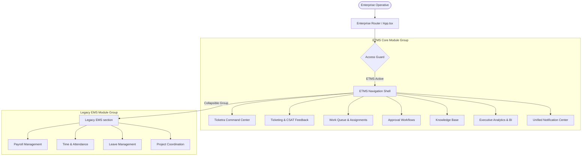

# Phase 8.2: Enterprise Productization Architecture Report
## Ticketra — Enterprise Ticket Management System (ETMS)

---

## 1. Executive Summary

This architecture report outlines the strategy and technical design for transforming the **Employee Management System (EMS)** into **Ticketra**, an enterprise-grade **Ticket Management System (ETMS)**. 

### Key Goals
- **Productization**: Pivot the system interface and backend capabilities to prioritize service operations and ticketing as the core enterprise utility.
- **EMS Preservation**: Retain all existing EMS modules (Payroll, Attendance, Leaves, Projects, Meetups, Documents, Reports) under a collapsed legacy section.
- **Zero-Disruption Migration**: Guarantee 100% backward compatibility via side-by-side modules, dual-mode shell layouts, and unified routing.

---

## 2. Architecture Overview



### Module Directory Structure

```
backend/src/modules/                  frontend/src/modules/
├── ticketing/                        ├── ticketing/
├── ticket-feedback/                  ├── ticket-feedback/
├── ticket-assignment/                ├── ticket-assignment/
├── communication-tracking/           ├── communication-tracking/
├── approval-management/              ├── approval-management/
├── knowledge-management/             ├── knowledge-management/
├── executive-analytics/              ├── executive-analytics/
└── notification-center/              └── notification-center/
```

---

## 3. Productization & Shell Customization

### Dual-Mode Shell Layout
The navigation layer utilizes two modes controlled by the configuration variable `VITE_ENABLE_ETMS_NAVIGATION`:
1. **Legacy Mode (`false`)**: Displays standard HR, operational, and financial links.
2. **ETMS Mode (`true`)**: Displays service operations (Tickets, Assignments, Approvals, KB, Analytics, Notifications) in prominent sections, and collapses legacy EMS systems under a unified **Legacy EMS** folder inside the sidebar.

```typescript
// frontend/src/config/navigation/index.ts
export const ETMS_NAV_GROUPS: Omit<NavGroup, 'items'>[] = [
  { id: 'dashboard', label: 'Dashboard', icon: LayoutDashboard, defaultExpanded: true },
  { id: 'tickets', label: 'Tickets', icon: Ticket, defaultExpanded: true, featureFlag: 'VITE_ENABLE_TICKETING' },
  { id: 'assignments', label: 'Assignments', icon: ClipboardList, defaultExpanded: true, featureFlag: 'VITE_ENABLE_TICKET_ASSIGNMENTS' },
  ...
  { id: 'legacy-ems', label: 'Legacy EMS', icon: Archive, defaultExpanded: false, isLegacy: true },
];
```

### Default Landing Experience
- Redirect path `/app` defaults to `/app/dashboard`.
- If `VITE_ENABLE_ETMS_DASHBOARD=true`, `/app/dashboard` resolves to `EtmsCommandDashboard`, turning the landing view into a high-visibility service operations room.

---

## 4. Feature Flags & Configuration

System feature flags allow switching experiences per environment without altering codebase branches:

| Flag Name | Scope | Default | Description |
|---|---|---|---|
| `ENABLE_TICKETING` | Shared | `true` | Activates core ticketing API endpoints and frontend forms |
| `ENABLE_TICKET_FEEDBACK` | Shared | `true` | Activates CSAT survey triggers and feedback charts |
| `ENABLE_TICKET_ASSIGNMENTS` | Shared | `true` | Activates assignment routing and workload panels |
| `ENABLE_APPROVAL_ENGINE` | Shared | `true` | Enables service request flows and approvals dashboard |
| `ENABLE_KNOWLEDGE_BASE` | Shared | `true` | Activates self-service articles and attachment directories |
| `ENABLE_EXECUTIVE_ANALYTICS` | Shared | `true` | Mounts executive BI dashboards and trends exports |
| `ENABLE_NOTIFICATION_CENTER` | Shared | `true` | Initiates real-time unified notification syncs |
| `VITE_ENABLE_ETMS_UI_V2` | Frontend | `true` | Toggles premium dark-theme elements and glassmorphic designs |
| `VITE_ENABLE_ETMS_NAVIGATION` | Frontend | `true` | Renders ETMS links with Legacy collapsed section |
| `VITE_ENABLE_ETMS_DASHBOARD` | Frontend | `true` | Displays ETMS Command Center as the landing page |

---

## 5. ETMS Dashboards

### A. Executive Dashboard (`/app/executive-dashboard`)
Tailored for leadership roles (`HR`, `ADMIN`, `SUPER_ADMIN`).
- **KPI Metrics**:
  - *Open Tickets*: Active issues categorized by priority.
  - *SLA Compliance*: Percent of tickets resolved within contract thresholds.
  - *Department Performance*: Average resolution duration grouped by department.
- **Analytics Charts**:
  - *Resolution Trends*: Line/bar charts mapping incoming vs. resolved ticket volume over time.
  - *Ticket Volume Analytics*: Heatmaps of peak intake hours and critical categories.

### B. Operations Dashboard (`/app/operator-dashboard`)
Tailored for operational users (`EMPLOYEE`, `MANAGER`).
- **My Queue**: Active tickets directly assigned to the logged-in agent.
- **Pending Approvals**: Workflows requiring immediate peer or managerial authorization before status advancement.
- **Escalations**: Highlight of breached or high-risk items requiring attention.
- **Workload Distribution**: Visual status of assigned tickets across the immediate team.

---

## 6. System Engines & Modules

### A. Unified Notification Center
- **In-App Alerts**: Real-time notifications pulled via websocket connections and stored in `public.notifications` for history lookup.
- **Email Delivery**: Automatic notification emails triggered by status updates or assignments (integrates with template layout rules).
- **Real-Time Synchronizer**: Runs a Redis-backed Socket.io adapter to push events instantly to active browser sessions.

### B. Service Level Agreement (SLA) Engine
- **Response SLA**: Tracks timestamp of ticket submission vs. initial status progression (e.g. `OPEN` to `IN_PROGRESS`).
- **Resolution SLA**: Tracks timestamp of submission vs. final closure (`RESOLVED` or `COMPLETED`).
- **Breach Detection**: Periodic workers query active tickets with impending deadlines relative to priority matrix configuration.
- **Escalation Triggers**: Auto-reassigns or elevates ticket priority when threshold is breached without action.

### C. Knowledge Base
- **Structured Categories**: Knowledge taxonomy (e.g., HR, Payroll, IT Service Desk, Security).
- **Rich Text Articles**: Formatted articles with embedded code blocks, alerts, and instructions.
- **Fuzzy Search**: Full-text search engine querying titles, content, and metadata keywords.
- **Secure Attachments**: Support for uploading and previewing files stored in Supabase storage buckets.

### D. Workflow Builder & Business Rules Engine
- **Status Transition Guard**: Schema-defined status lifecycle preventing invalid state changes (e.g., skipping `IN_PROGRESS` straight to `CLOSED`).
- **Approval Chains**: Multi-tier approvals hooked into ticket categories.
- **Assignment Routing Engine**:
  - *Round Robin*: Balances ticket load equally among available agents.
  - *SLA-Based Escalation*: Moves unaddressed items automatically to parent queues.
  - *Automatic Notifications*: Alerts agents on assignments and managers on breaches.

---

## 7. Backward Compatibility & Legacy Preservation

To maintain backward compatibility:
- **Database schemas** are kept fully intact; no column or table drops are performed.
- **Legacy controller files** remain untouched and accessible by the original routes.
- **EMS Navigation** remains functional — if a user toggles the ETMS flag off, the workspace reverts to the original EMS layout.
- **API Versioning**: New routes map to modular layouts (`/api/tickets`, `/api/approvals`, etc.), preserving the old endpoints for core EMS modules.
