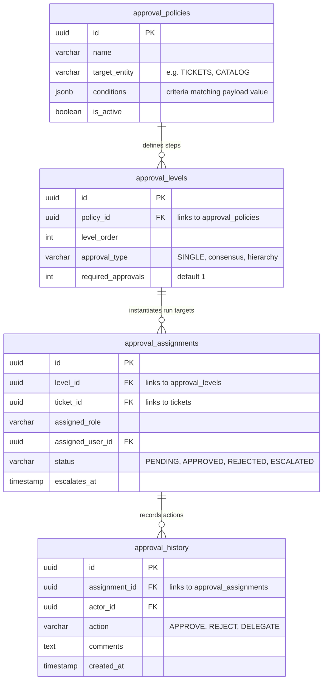

# APPROVAL ENGINE ARCHITECTURE
# Decoupled Enterprise Approval and Consent Engine

This document details the architectural layout, schemas, and routing flows of the dedicated Ticketra ETMS Approval Engine.

---

## 1. Functional Architecture & Support Matrix

* **Single Approval:** Direct approval by a single designated actor (User or Role).
* **Multi-Level Approval:** Sequential execution (Level 1 must approve before Level 2 is notified).
* **Role-Based:** Anyone holding the specified role (e.g. `HR_MANAGER`) can approve.
* **User-Based:** Only the specific user ID assigned can approve.
* **Escalation Approval:** If an approval is pending beyond the SLA target, it is reassigned to the supervisor.
* **Rejection Flow:** Policy dictates whether a rejection closes the ticket, rolls it back to draft, or routes it to a review step.

---

## 2. Entity Relationship Diagram (ERD)



---

## 3. Database Schema Definitions (SQL)

```sql
-- Approval Rules Definition
CREATE TABLE approval_policies (
    id UUID PRIMARY KEY DEFAULT gen_random_uuid(),
    name VARCHAR(255) NOT NULL,
    target_entity VARCHAR(100) NOT NULL, -- 'tickets', 'service_requests'
    conditions JSONB DEFAULT '{}'::jsonb,  -- e.g., {"amount_greater_than": 5000}
    is_active BOOLEAN DEFAULT true,
    created_at TIMESTAMP WITH TIME ZONE DEFAULT CURRENT_TIMESTAMP
);

-- Sequential Verification Levels
CREATE TABLE approval_levels (
    id UUID PRIMARY KEY DEFAULT gen_random_uuid(),
    policy_id UUID REFERENCES approval_policies(id) ON DELETE CASCADE,
    level_order INTEGER NOT NULL, -- e.g., 1 (Manager), 2 (Director)
    approval_type VARCHAR(50) DEFAULT 'SINGLE', -- 'SINGLE', 'ANY', 'ALL'
    required_approvals INTEGER DEFAULT 1,
    created_at TIMESTAMP WITH TIME ZONE DEFAULT CURRENT_TIMESTAMP,
    CONSTRAINT unique_policy_level UNIQUE (policy_id, level_order)
);

-- Operational Assignments Linker
CREATE TABLE approval_assignments (
    id UUID PRIMARY KEY DEFAULT gen_random_uuid(),
    level_id UUID REFERENCES approval_levels(id) ON DELETE CASCADE,
    ticket_id UUID REFERENCES tickets(id) ON DELETE CASCADE,
    assigned_role VARCHAR(100),
    assigned_user_id UUID REFERENCES auth.users(id),
    status VARCHAR(50) DEFAULT 'PENDING' CHECK (status IN ('PENDING', 'APPROVED', 'REJECTED', 'ESCALATED')),
    escalates_at TIMESTAMP WITH TIME ZONE,
    created_at TIMESTAMP WITH TIME ZONE DEFAULT CURRENT_TIMESTAMP
);

-- Immutable History Log
CREATE TABLE approval_history (
    id UUID PRIMARY KEY DEFAULT gen_random_uuid(),
    assignment_id UUID REFERENCES approval_assignments(id) ON DELETE CASCADE,
    actor_id UUID REFERENCES auth.users(id),
    action VARCHAR(50) NOT NULL CHECK (action IN ('APPROVED', 'REJECTED', 'DELEGATED', 'ESCALATED')),
    comments TEXT,
    created_at TIMESTAMP WITH TIME ZONE DEFAULT CURRENT_TIMESTAMP
);

-- Create Indexes
CREATE INDEX idx_aa_ticket_status ON approval_assignments(ticket_id, status);
CREATE INDEX idx_aa_assigned_user ON approval_assignments(assigned_user_id) WHERE status = 'PENDING';
```

---

## 4. Backend Modules & API Design

Files structure in `backend/src/modules/approval-engine/`:
* `approval.controller.js`: Handles API requests.
* `approval-policy.service.js`: Matches target entities against active policies.
* `approval-execution.service.js`: Processes approval transitions, updates status, and triggers escalations.
* `approval.routes.js`: Defines API endpoints.

### Core API Endpoints

#### POST `/api/v1/approvals/evaluate`
Triggers policies matches for a specific ticket.
* **Payload:** `{ ticket_id: "uuid" }`
* **Response:** `{ success: true, policy_matched: "uuid", active_level: 1 }`

#### POST `/api/v1/approvals/action`
Saves an approval or rejection.
* **Payload:** `{ assignment_id: "uuid", action: "APPROVED" | "REJECTED", comments: "optional text" }`
* **Response:** `{ success: true, next_step: "PENDING" | "COMPLETED" }`

---

## 5. Frontend Screens & Controls

* **Approvals Portal (`/app/approvals`):** Lists pending items awaiting action. Includes filters for "Assigned to Me", "My Group", and "Historical Decisions".
* **Approval Card Widget:** Mounted on the ticket details panel, displaying current level details, status indicators, action buttons (Approve/Reject), and comment boxes.
* **Approval Matrix Designer:** Settings panel for admins to define policies, write rule parameters, assign users or roles, and specify rejection behaviors.

---

## 6. RBAC Permissions Matrix

| Operations / Roles | ADMIN | MANAGER | HR | EMPLOYEE |
|---|---|---|---|---|
| **Manage Policies** | Allowed | Allowed | Denied | Denied |
| **View All History** | Allowed | Allowed | Allowed | Denied (Own only) |
| **Approve Assignment** | If Assigned | If Assigned | If Assigned | If Assigned |
| **Override Approvals** | Allowed | Denied | Denied | Denied |
