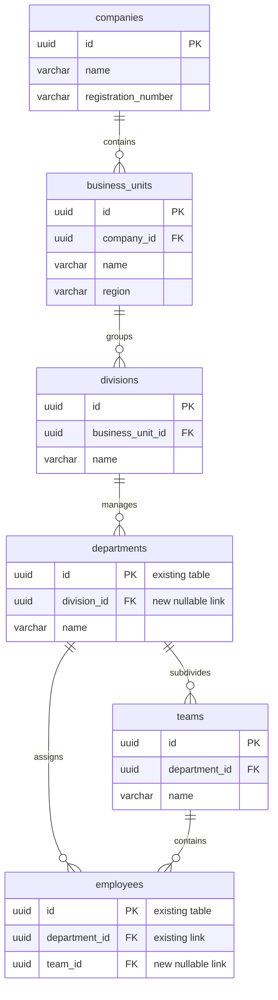

# BUSINESS UNIT HIERARCHY
# Enterprise Organizational Structure and Resource Segmentation

This document details the hierarchical model, schemas, migrations, and access control boundaries for business units.

---

## 1. Hierarchical Organizational Model

To scale to enterprise deployments, the system models resources inside a 5-tier organizational tree:

```
┌────────────────────────────────────────┐
│             1. Company                 │  (Top-Level Entity)
└──────────────────┬─────────────────────┘
                   │ (1:N)
┌──────────────────▼─────────────────────┐
│          2. Business Unit              │  (Subsidiaries or Geo Divisions)
└──────────────────┬─────────────────────┘
                   │ (1:N)
┌──────────────────▼─────────────────────┐
│             3. Division                │  (Operational Lines of Business)
└──────────────────┬─────────────────────┘
                   │ (1:N)
┌──────────────────▼─────────────────────┐
│            4. Department               │  (Existing Target Group: IT, HR)
└──────────────────┬─────────────────────┘
                   │ (1:N)
┌──────────────────▼─────────────────────┐
│               5. Team                  │  (Functional Working Squads)
└────────────────────────────────────────┘
```

---

## 2. Entity Relationship Diagram (ERD)



---

## 3. Database Schema Definitions (SQL)

```sql
-- Top level Tenant/Company
CREATE TABLE companies (
    id UUID PRIMARY KEY DEFAULT gen_random_uuid(),
    name VARCHAR(255) NOT NULL,
    registration_number VARCHAR(100),
    created_at TIMESTAMP WITH TIME ZONE DEFAULT CURRENT_TIMESTAMP
);

-- Business Unit Segment
CREATE TABLE business_units (
    id UUID PRIMARY KEY DEFAULT gen_random_uuid(),
    company_id UUID REFERENCES companies(id) ON DELETE CASCADE,
    name VARCHAR(255) NOT NULL,
    region VARCHAR(100),
    created_at TIMESTAMP WITH TIME ZONE DEFAULT CURRENT_TIMESTAMP
);

-- Division Line
CREATE TABLE divisions (
    id UUID PRIMARY KEY DEFAULT gen_random_uuid(),
    business_unit_id UUID REFERENCES business_units(id) ON DELETE CASCADE,
    name VARCHAR(255) NOT NULL,
    created_at TIMESTAMP WITH TIME ZONE DEFAULT CURRENT_TIMESTAMP
);

-- Additive Change ONLY to existing departments table (No data-loss alters)
ALTER TABLE departments ADD COLUMN division_id UUID REFERENCES divisions(id) ON DELETE SET NULL;

-- Dynamic Work Teams
CREATE TABLE teams (
    id UUID PRIMARY KEY DEFAULT gen_random_uuid(),
    department_id UUID REFERENCES departments(id) ON DELETE CASCADE,
    name VARCHAR(255) NOT NULL,
    created_at TIMESTAMP WITH TIME ZONE DEFAULT CURRENT_TIMESTAMP
);

-- Additive Change ONLY to existing employees table to assign team IDs
ALTER TABLE employees ADD COLUMN team_id UUID REFERENCES teams(id) ON DELETE SET NULL;

-- Create Indexes for fast traversal checks
CREATE INDEX idx_bu_company ON business_units(company_id);
CREATE INDEX idx_div_bu ON divisions(business_unit_id);
CREATE INDEX idx_dept_div ON departments(division_id);
CREATE INDEX idx_teams_dept ON teams(department_id);
CREATE INDEX idx_emp_team ON employees(team_id);
```

---

## 4. Additive Migration Plan

To prevent downtime or breaking dependencies in legacy EMS modules:
1. **Deploy New Independent Tables:** Create `companies`, `business_units`, and `divisions` in that order.
2. **Safely Modify Existing Tables:** Execute `ALTER TABLE departments ADD COLUMN division_id...` as a nullable field. This ensures existing department references in active code run without changes.
3. **Deploy Team Structures:** Create `teams` table.
4. **Link Employees:** Execute `ALTER TABLE employees ADD COLUMN team_id...` as a nullable field. Existing logic queries employees matching department targets normal.
5. **Backfill Step:** Seed a default Company, Business Unit, and Division, and assign existing departments to this root.

---

## 5. RBAC & Analytics Implications

### RBAC Implications
Security policies (Supabase RLS) will enforce hierarchical access controls:
* **Department Isolation:** Agents can view tickets within their own Department.
* **Division/Business Unit Visibility:** Division Managers can view aggregated ticket queues and performance matrices for all child departments.
* **Corporate Audit Controls:** Corporate Admins have full read access across all Business Units.

### Analytics Implications
Database aggregation tasks scale dynamically:
* Metrics (such as average resolution times) can be aggregated at the corporate, division, department, or team level.
* Snapped aggregates table references `business_unit_id` and `division_id`, allowing multi-dimensional filtering inside the Executive Command dashboards.
