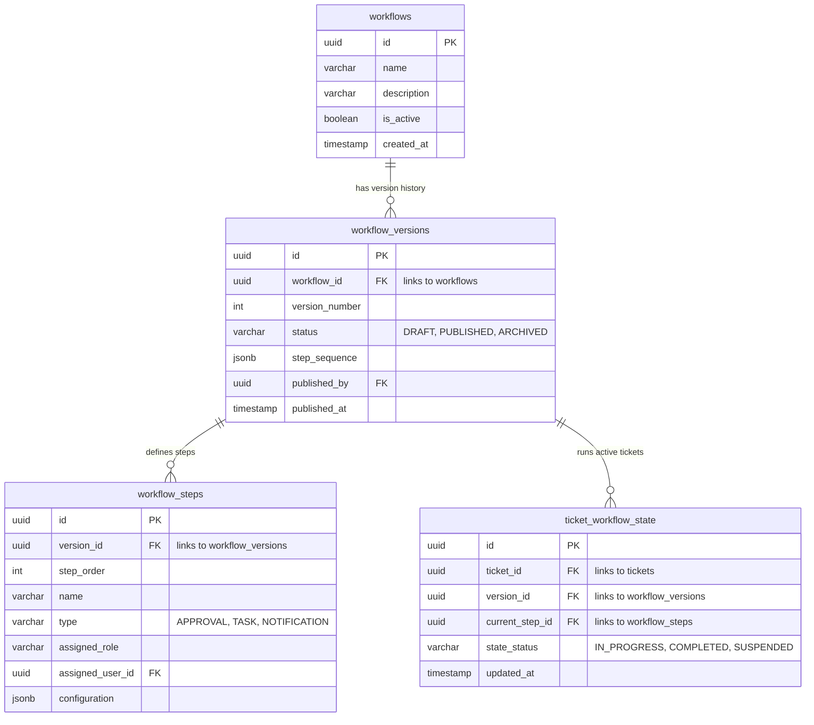

# WORKFLOW VERSIONING DESIGN
# Enterprise Workflow Versioning & Lifecycle Architecture

This document describes the schema design, lifecycle states, and ticket isolation rules for enterprise workflow versioning.

---

## 1. Workflow Lifecycle & State Machine

Workflows transition through three distinct lifecycle states:
1. **DRAFT:** Workflows currently being edited. No tickets can be assigned to a draft version.
2. **PUBLISHED:** The current active version of the workflow. New tickets are assigned to this version.
3. **ARCHIVED:** Older, superseded versions. Existing tickets finish their execution using these versions, but no new tickets are assigned.

```
┌─────────────┐        ┌─────────────┐        ┌─────────────┐
│    DRAFT    ├───────►│  PUBLISHED  ├───────►│  ARCHIVED   │
└──────▲──────┘        └──────┬──────┘        └─────────────┘
       │                      │
       └──────────────────────┘
            Rollback / Copy
```

---

## 2. Entity Relationship Diagram (ERD)



---

## 3. Database Schema Definitions (SQL)

```sql
-- Workflow Container
CREATE TABLE workflows (
    id UUID PRIMARY KEY DEFAULT gen_random_uuid(),
    name VARCHAR(255) NOT NULL,
    description TEXT,
    is_active BOOLEAN DEFAULT true,
    created_at TIMESTAMP WITH TIME ZONE DEFAULT CURRENT_TIMESTAMP,
    updated_at TIMESTAMP WITH TIME ZONE DEFAULT CURRENT_TIMESTAMP
);

-- Version Controller
CREATE TABLE workflow_versions (
    id UUID PRIMARY KEY DEFAULT gen_random_uuid(),
    workflow_id UUID REFERENCES workflows(id) ON DELETE CASCADE,
    version_number INTEGER NOT NULL,
    status VARCHAR(50) NOT NULL CHECK (status IN ('DRAFT', 'PUBLISHED', 'ARCHIVED')),
    published_by UUID REFERENCES auth.users(id),
    published_at TIMESTAMP WITH TIME ZONE,
    created_at TIMESTAMP WITH TIME ZONE DEFAULT CURRENT_TIMESTAMP,
    CONSTRAINT unique_workflow_version UNIQUE (workflow_id, version_number)
);

-- Workflow Steps (tied to a specific version)
CREATE TABLE workflow_steps (
    id UUID PRIMARY KEY DEFAULT gen_random_uuid(),
    version_id UUID REFERENCES workflow_versions(id) ON DELETE CASCADE,
    step_order INTEGER NOT NULL,
    name VARCHAR(255) NOT NULL,
    type VARCHAR(50) NOT NULL CHECK (type IN ('APPROVAL', 'TASK', 'NOTIFICATION')),
    assigned_role VARCHAR(100),
    assigned_user_id UUID REFERENCES auth.users(id),
    configuration JSONB DEFAULT '{}'::jsonb,
    created_at TIMESTAMP WITH TIME ZONE DEFAULT CURRENT_TIMESTAMP,
    CONSTRAINT unique_version_step_order UNIQUE (version_id, step_order)
);

-- Active Ticket Run State
CREATE TABLE ticket_workflow_state (
    id UUID PRIMARY KEY DEFAULT gen_random_uuid(),
    ticket_id UUID REFERENCES tickets(id) ON DELETE CASCADE,
    version_id UUID REFERENCES workflow_versions(id),
    current_step_id UUID REFERENCES workflow_steps(id),
    state_status VARCHAR(50) DEFAULT 'IN_PROGRESS' CHECK (state_status IN ('IN_PROGRESS', 'COMPLETED', 'SUSPENDED')),
    updated_at TIMESTAMP WITH TIME ZONE DEFAULT CURRENT_TIMESTAMP
);

-- Create Indexes
CREATE INDEX idx_wv_workflow_status ON workflow_versions(workflow_id, status);
CREATE INDEX idx_ws_version_order ON workflow_steps(version_id, step_order);
CREATE INDEX idx_tws_ticket_version ON ticket_workflow_state(ticket_id, version_id);
```

---

## 4. Ticket Isolation and Validation Logic

### Existing Tickets Keep Old Versions
When a new workflow version is published, the old version is updated to `ARCHIVED`. However, existing records in `ticket_workflow_state` remain linked to the archived version. The engine resolves steps by querying the step sequence defined on `workflow_steps` linked to that ticket's specific `version_id`.

### New Tickets Use Latest Version
When a ticket is created, the system fetches the current published version of the workflow using the following query:
```sql
SELECT id FROM workflow_versions 
WHERE workflow_id = :target_workflow_id AND status = 'PUBLISHED'
LIMIT 1;
```
If a published version exists, a new row is written to `ticket_workflow_state` linking the ticket to that version ID and the first step ID (order = 1).

### Rollback Process
To roll back a workflow configuration to a previous version, the system creates a new draft version, copies the step configurations from the targeted historic version, increments the version number, and publishes the new version. Existing active tickets continue using their original versions, preventing state corruption.
