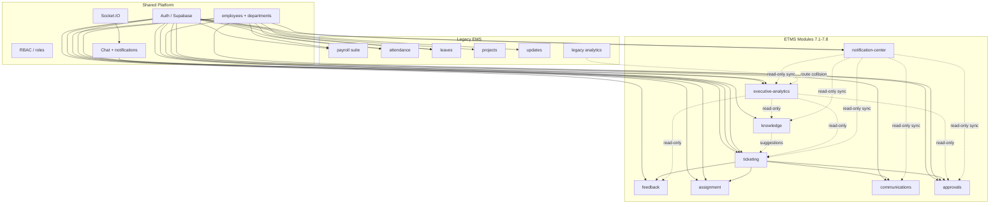

# Phase 8.0.3 — Dependency Map

**Date:** 2026-06-19  
**Mode:** Audit only

---

## Dependency Graph Overview



---

## Frontend Component Dependencies

### If Removed: Payroll Modules

| Breaks | Does NOT Break |
|--------|----------------|
| All `/app/payroll/*` routes | Ticketing routes |
| Payroll nav groups in AppLayout | ETMS module nav (additive) |
| `Payroll.tsx`, `MyPayslips.tsx` pages | Auth, profile |
| Bulk upload, compliance, treasury UIs | Ticket create/detail |

**Rollback:** Re-enable payroll route imports in `App.tsx` and nav in `AppLayout.tsx`.

### If Removed: Attendance / Leaves

| Breaks | Does NOT Break |
|--------|----------------|
| `/app/attendance`, `/app/leaves` | Tickets, assignments |
| HR nav items | Employee directory (still usable) |

### If Removed: Legacy Analytics (FE)

No dedicated FE module — legacy analytics is backend-only. Phase 7.7 `executive-analytics` is independent.

### If Removed: ETMS Module (e.g. ticketing)

| Breaks | Cascade |
|--------|---------|
| All ticket pages | 7.1–7.8 modules lose data sources |
| Ticket nav | Approval tab on ticket detail |
| Knowledge suggestions on create | Executive analytics KPIs |

**DO NOT TOUCH** without full regression plan.

---

## Backend Service Dependencies

| Service | Upstream | Downstream Consumers |
|---------|----------|---------------------|
| `auth.middleware.js` | Supabase Auth | All protected routes |
| `role-resolution.service.js` | `user_roles`, `employees.role` | RBAC on all modules |
| `ticketing/services/ticket.service.js` | `tickets`, categories | Comments, SLA, assignments |
| `ticketing/services/notification.service.js` | `ChatService` | Ticket event notifications |
| `executive-analytics.repository.js` | tickets, feedback, approvals (read) | Dashboard APIs |
| `notification-center-event-sync.service.js` | timeline, approvals (read) | Center events |
| `payroll/*` services | payroll tables | Bulk processing, payslips |
| `backend/analytics/analytics.service.js` | employees, attendance, leaves | `/api/analytics` legacy endpoints |

### Critical Collision

```
app.js:153  → app.use('/api/analytics', legacy @analytics)
app.js:235  → app.use('/api/analytics', executive-analytics)  [if ENABLE_EXECUTIVE_ANALYTICS=true]
```

**First registered wins.** When both mounted, Phase 7.7 routes may be unreachable for overlapping paths.

**If legacy analytics removed:** Phase 7.7 can own `/api/analytics` exclusively.  
**If legacy kept:** Phase 7.7 should move to `/api/executive-analytics` (contract change — Phase 8.1 decision).

---

## Repository / Database Dependencies

| Table | ETMS Modules Using | EMS Modules Using |
|-------|-------------------|-------------------|
| `employees` | ticketing, assignment, approvals, analytics, notifications | payroll, attendance, leaves, all HR |
| `departments` | ticketing, executive-analytics | payroll analytics, HR |
| `users` | auth (all) | auth (all) |
| `tickets` | core + 7.1–7.5 | — |
| `ticket_*` (7.x tables) | respective modules | — |
| `payroll_*` (~80 tables) | — | payroll suite only |
| `attendance`, `leaves` | — | EMS only |
| `notifications`, `chat_*` | ticketing notifications | general platform |
| `notification_center_*` | 7.8 only | — |

### FK Chain (Simplified)

```
users ← employees ← tickets ← ticket_comments, ticket_feedback, ticket_approvals, ...
employees ← payroll_records, attendance, leaves, employee_salary_assignments, ...
departments ← employees, tickets.department_id, ticket_sla_rules
```

**Removing `employees` or `departments` breaks entire ETMS.**

---

## Route Dependencies

| Route Prefix | Flag Gated | Depends On |
|--------------|------------|------------|
| `/api/tickets` | `ENABLE_TICKETING` | auth, employees, departments |
| `/api/ticket-feedback` | `ENABLE_TICKET_FEEDBACK` | tickets |
| `/api/ticket-assignments` | `ENABLE_TICKET_ASSIGNMENTS` | tickets, employees |
| `/api/communications` | `ENABLE_COMMUNICATION_TRACKING` | tickets |
| `/api/approvals` | `ENABLE_APPROVAL_ENGINE` | tickets, employees |
| `/api/knowledge` | `ENABLE_KNOWLEDGE_BASE` | employees |
| `/api/analytics` | 7.7 flag + **legacy always** | see collision |
| `/api/notification-center` | `ENABLE_NOTIFICATION_CENTER` | employees |
| `/api/payroll` | **None (always on)** | employees, admin role |
| `/api/attendance`, `/api/leaves` | **None** | employees |

---

## Feature Flag Dependencies

| Flag | Frontend | Backend | Paired |
|------|----------|---------|--------|
| `VITE_ENABLE_TICKETING` | routes | `ENABLE_TICKETING` | ✓ |
| `VITE_ENABLE_TICKET_FEEDBACK` | routes | `ENABLE_TICKET_FEEDBACK` | ✓ |
| … (7.2–7.8) | … | … | ✓ |
| Payroll | **No flag** | **No flag** | — |
| Attendance/Leaves | **No flag** | **No flag** | — |

**Implication:** EMS modules cannot be disabled without code changes; ETMS modules can.

---

## Environment Variable Dependencies

| Variable | Used By | ETMS | EMS |
|----------|---------|------|-----|
| `SUPABASE_URL`, `SUPABASE_*` | All | ✓ | ✓ |
| `JWT_SECRET` | Auth bootstrap | ✓ | ✓ |
| `FRONTEND_URL`, `CORS_*` | CORS | ✓ | ✓ |
| `ENABLE_TICKETING` … `ENABLE_NOTIFICATION_CENTER` | ETMS modules | ✓ | — |
| `ENABLE_REDIS`, `ENABLE_SOCKET_REDIS` | Socket scaling | ✓ | ✓ |
| `VITE_API_URL` | Frontend API | ✓ | ✓ |
| `VITE_ENABLE_*` | Frontend ETMS gates | ✓ | — |

---

## Removal Impact Summary

| Remove | Immediate Break | Mitigation |
|--------|-----------------|------------|
| Payroll module | Payroll UI/API only | Flag + archive DB |
| Legacy `@analytics` | HR dashboard widgets | Migrate users to 7.7 |
| Attendance/Leaves | HR pages only | Low risk |
| `employees` table | **Total platform failure** | **Never remove** |
| Ticketing module | **ETMS total failure** | **Never remove** |
| Chat/notifications | Ticket realtime + bell | Keep; 7.8 is parallel |
