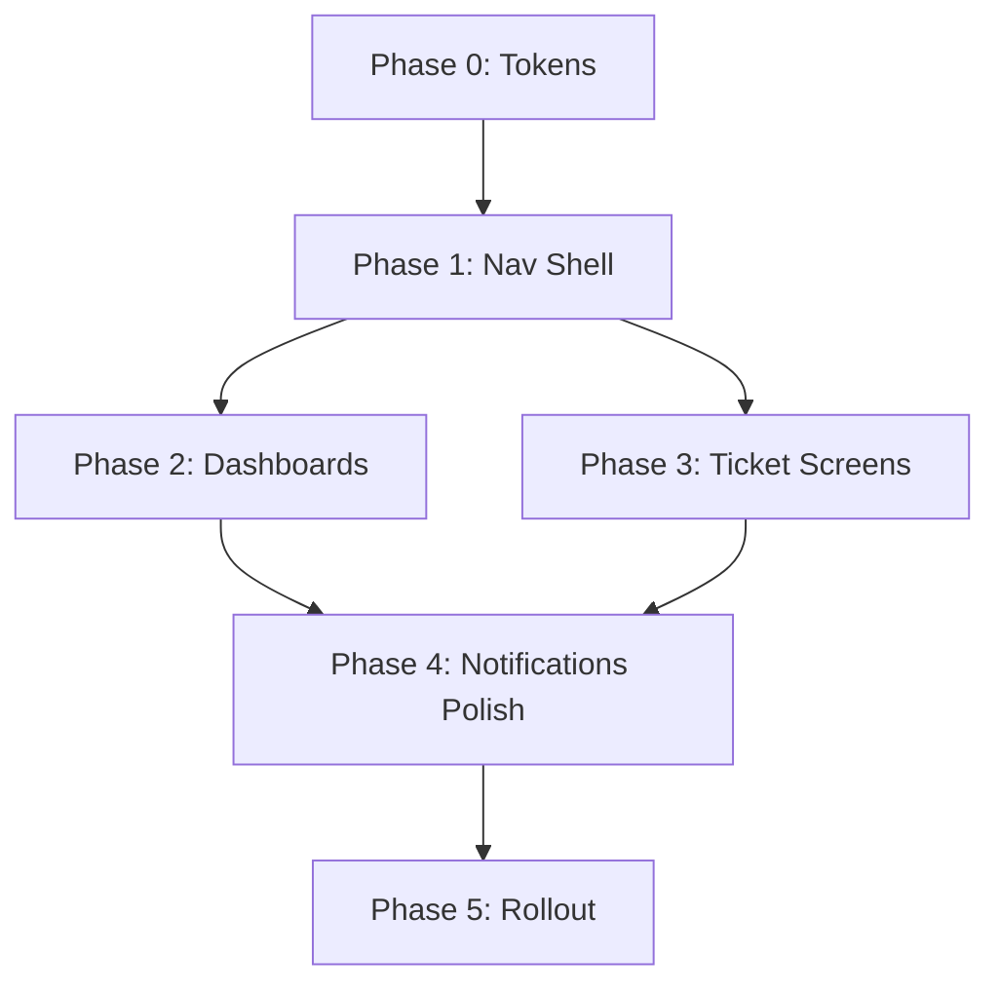

# Implementation Roadmap — Ticketra ETMS UI Transformation

**Date:** 2026-06-19  
**Version:** 1.0  
**Constraint:** No EMS functionality removed. ETMS becomes primary. Legacy EMS collapsed by default.

---

## Executive Summary

This roadmap delivers the ETMS UI transformation in **5 phases over ~8–10 weeks**, minimizing regression risk by refactoring the shell first, then dashboards, then deep screen upgrades. Each phase is independently deployable behind feature flags.

---

## Phase Overview

| Phase | Focus | Duration | Risk |
|-------|-------|----------|------|
| **0** | Foundation & tokens | 1 week | Low |
| **1** | Navigation & shell | 2 weeks | Medium |
| **2** | Dashboards | 2 weeks | Medium |
| **3** | Core ETMS screens | 2 weeks | Medium |
| **4** | Notification center & polish | 1–2 weeks | Low |
| **5** | QA, UAT, rollout | 1 week | Low |

---

## Phase 0 — Foundation (Week 1)

### Goals
- Establish ETMS design tokens without breaking existing pages
- Create navigation config scaffolding
- Add feature flag for gradual rollout

### Tasks

| # | Task | Files | Effort |
|---|------|-------|--------|
| 0.1 | Add ETMS token block to `design-tokens.css` | `styles/design-tokens.css` | S |
| 0.2 | Map shadcn `--primary` to `#2563EB` | `index.css` | S |
| 0.3 | Extend Tailwind theme with semantic colors | `tailwind.config.ts` | S |
| 0.4 | Create `config/navigation.ts` + utils | New files | M |
| 0.5 | Add `VITE_ENABLE_ETMS_UI_V2` feature flag | `features.ts`, `.env.example` | S |
| 0.6 | Create `modules/dashboard/` scaffold | New module dir | S |

### Exit Criteria
- Tokens available in Tailwind as `bg-etms-primary`, etc.
- Navigation config exports ETMS + Legacy groups (not yet wired)
- Flag defaults `false` in `.env.example`

### Tests
- Token snapshot test (CSS variables present)
- Feature flag unit test

---

## Phase 1 — Navigation & Shell (Weeks 2–3)

### Goals
- ETMS-primary sidebar live behind flag
- Legacy EMS collapsed by default
- Rebrand app shell to Ticketra ETMS

### Tasks

| # | Task | Files | Effort |
|---|------|-------|--------|
| 1.1 | Wire `allNavGroups` into AppLayout behind flag | `AppLayout.tsx`, `navigation.ts` | L |
| 1.2 | Remove inline 9-group EMS array (when flag on) | `AppLayout.tsx` | M |
| 1.3 | Implement Legacy EMS group with 6 items | `navigation.ts` | M |
| 1.4 | Update localStorage defaults + migration | `AppLayout.tsx` | S |
| 1.5 | Rebrand sidebar: Ticketra ETMS wordmark | `EmtsBrandMark.tsx` or new | S |
| 1.6 | Apply surface tokens; remove `#c1e1ec` inline bg | `AppLayout.tsx` | M |
| 1.7 | Sidebar visual refresh (12px radius, primary accent) | `AppLayout.tsx` | M |
| 1.8 | Add ThemeToggle to header | `AppLayout.tsx`, `ThemeToggle.tsx` | S |
| 1.9 | Add Quick Create Ticket button | New component | S |
| 1.10 | Add DepartmentSelector (read-only v1) | New component | M |
| 1.11 | Update CommandPalette + GlobalSearch index | `CommandPalette.tsx`, `GlobalSearch.tsx` | M |
| 1.12 | Relabel module nav files to match IA | 8× `*.nav.ts` | M |

### Exit Criteria
- With `VITE_ENABLE_ETMS_UI_V2=true`: sidebar shows ETMS groups first, Legacy EMS collapsed
- With flag `false`: current sidebar unchanged (rollback safe)
- All EMS routes reachable via Legacy EMS → Payroll or direct URL
- Theme toggle works in authenticated shell

### Tests
- Nav order snapshot (ETMS before Legacy)
- Legacy EMS default collapsed
- RBAC filtering unchanged
- Mobile drawer functional
- All existing nav route tests pass

---

## Phase 2 — Dashboards (Weeks 4–5)

### Goals
- Command Dashboard communicates ETMS identity
- Executive Dashboard extended per spec
- Operator Dashboard for agents

### Tasks

| # | Task | Files | Effort |
|---|------|-------|--------|
| 2.1 | Build `EtmsKpiGrid` (6 KPI cards) | `modules/dashboard/components/` | M |
| 2.2 | Build `TicketStatusChart` | Same | M |
| 2.3 | Build `DepartmentPerformancePanel` | Same | M |
| 2.4 | Build `EtmsActivityFeed` | Same | L |
| 2.5 | Create `useEtmsDashboard` hook + service | hooks, services | M |
| 2.6 | Refactor `Dashboard.tsx` → Command Dashboard | `pages/Dashboard.tsx` | L |
| 2.7 | Remove EMS widgets from command dashboard | `Dashboard.tsx` | S |
| 2.8 | Extend `ExecutiveDashboardPage` charts | executive-analytics module | L |
| 2.9 | Create `OperatorDashboardPage` | New page + route | L |
| 2.10 | Create `SlaDashboardPage` (basic v1) | New page + route | M |
| 2.11 | Backend: ticket stats endpoints (if needed) | backend ticketing | L |

### API Dependencies

| Endpoint | Phase | Fallback |
|----------|-------|----------|
| Ticket stats aggregate | 2 | Client-side from list API |
| Activity feed | 2 | Notification center events |
| SLA metrics | 2 | Existing SLA card data |

### Exit Criteria
- Command dashboard shows 6 ETMS KPIs, status chart, dept performance, activity feed
- No HR workforce metrics on command dashboard
- Executive dashboard has all specified cards + charts
- Operator dashboard shows personal queue summary

### Tests
- Dashboard component unit tests
- Role-based section visibility
- Loading/error states
- API integration tests (if new endpoints)

---

## Phase 3 — Core ETMS Screens (Weeks 6–7)

### Goals
- Enterprise ticket list with full data table
- Professional three-column ticket detail
- Approval tabs; KB route splits

### Tasks

| # | Task | Files | Effort |
|---|------|-------|--------|
| 3.1 | Upgrade `TicketListPage` to data table | DataTable component | L |
| 3.2 | Add sorting, filtering, search, export | TicketListPage | L |
| 3.3 | Add bulk actions (assign, close, priority) | TicketListPage | M |
| 3.4 | Implement scope query params (mine/team/all) | TicketListPage, filters | M |
| 3.5 | Restructure `TicketDetailPage` 3-column layout | TicketDetailPage | L |
| 3.6 | Wire approval status panel on ticket detail | Approval tab component | M |
| 3.7 | Add activity log panel | TicketDetailPage | M |
| 3.8 | My Approvals status tabs | MyApprovalsPage | S |
| 3.9 | KB categories + search routes | New pages or tabs | M |
| 3.10 | Communications announcements/discussions routes | New pages or tabs | M |

### Exit Criteria
- Ticket list meets enterprise data table spec
- Ticket detail matches left/center/right layout
- Scope filters work from sidebar links

### Tests
- TicketListPage extended tests
- TicketDetailPage layout tests
- Bulk action RBAC tests
- Export format validation

---

## Phase 4 — Notification Center & Polish (Week 8)

### Goals
- Unified notification center with tabs
- Consolidate dual bell UI
- Accessibility pass

### Tasks

| # | Task | Files | Effort |
|---|------|-------|--------|
| 4.1 | Tabbed notification center (5 tabs) | NotificationCenterPage | M |
| 4.2 | Consolidate NotificationBell + UnreadBadge | AppLayout | M |
| 4.3 | `aria-current` on active nav | AppLayout | S |
| 4.4 | Focus ring tokens on interactive elements | design-system | S |
| 4.5 | `prefers-reduced-motion` support | CSS | S |
| 4.6 | Remove or wire MegaMenu | AppLayout | S |
| 4.7 | Responsive QA pass (desktop/tablet/mobile) | — | M |
| 4.8 | Dark mode parity audit | All shell components | M |

### Exit Criteria
- Single notification entry point with tabs
- WCAG AA contrast verified on primary flows
- Keyboard navigation complete for sidebar + header

---

## Phase 5 — QA, UAT & Rollout (Week 9–10)

### Goals
- Production-ready ETMS experience
- Default flags updated for ETMS deployments

### Tasks

| # | Task | Owner | Effort |
|---|------|-------|--------|
| 5.1 | Full regression test suite | QA | L |
| 5.2 | UAT checklist execution | Product | M |
| 5.3 | Update `.env.example` — core ETMS flags `true` | DevOps | S |
| 5.4 | Enable `VITE_ENABLE_ETMS_UI_V2` in production | DevOps | S |
| 5.5 | User communication / release notes | Product | S |
| 5.6 | Monitor error rates post-deploy | DevOps | S |
| 5.7 | Remove old sidebar code path (flag cleanup) | Dev | M |

### UAT Checklist (Summary)

- [ ] New user identifies app as ticket management system within 10 seconds
- [ ] Create ticket in ≤2 clicks from any page
- [ ] Legacy EMS reachable but not visible until expanded
- [ ] All payroll deep links work from Legacy EMS → Payroll
- [ ] Operator can complete daily queue from Operator Dashboard
- [ ] Executive sees SLA and trend charts
- [ ] Mobile: primary ETMS nav accessible without excessive scroll
- [ ] Dark mode: all dashboard charts readable

---

## Feature Flag Strategy

| Flag | Purpose | Default (dev) | Default (prod after rollout) |
|------|---------|---------------|------------------------------|
| `VITE_ENABLE_ETMS_UI_V2` | New nav + shell | `false` → `true` | `true` |
| `VITE_ENABLE_TICKETING` | Ticketing module | `true` | `true` |
| `VITE_ENABLE_TICKET_ASSIGNMENTS` | Assignments | `true` | `true` |
| `VITE_ENABLE_APPROVAL_ENGINE` | Approvals | `true` | `true` |
| `VITE_ENABLE_KNOWLEDGE_BASE` | KB | `true` | `true` |
| `VITE_ENABLE_COMMUNICATION_TRACKING` | Comms | `true` | `true` |
| `VITE_ENABLE_EXECUTIVE_ANALYTICS` | Analytics | `true` | `true` |
| `VITE_ENABLE_NOTIFICATION_CENTER` | Notifications | `true` | `true` |
| `VITE_ENABLE_TICKET_FEEDBACK` | CSAT | `false` | configurable |

---

## Team & Ownership

| Area | Primary | Support |
|------|---------|---------|
| Navigation / shell | Frontend | Design |
| Dashboards | Frontend | Backend (stats API) |
| Ticket screens | Frontend | Backend |
| Design tokens | Frontend | Design |
| QA / a11y | QA | Frontend |
| Docs / UAT | Product | All |

---

## Dependencies

---

## Risk Register (UI-Specific)

| ID | Risk | Impact | Mitigation |
|----|------|--------|------------|
| R1 | Payroll users disoriented | High | Legacy EMS label + payroll sub-nav unchanged |
| R2 | Stats API not ready | Medium | Client-side aggregation fallback |
| R3 | Large AppLayout diff | Medium | Feature flag parallel paths |
| R4 | Test breakage | Medium | Phase-by-phase test updates |
| R5 | Dark mode regressions | Low | Phase 4 dedicated audit |

---

## Definition of Done

The ETMS UI transformation is complete when:

1. ✅ Sidebar shows ETMS primary nav with Legacy EMS collapsed by default
2. ✅ Command Dashboard displays 6 ETMS KPIs + charts + activity feed
3. ✅ Executive and Operator dashboards live
4. ✅ Ticket list is enterprise-grade data table
5. ✅ Ticket detail uses three-column layout
6. ✅ Notification center has unified tabs
7. ✅ Top navbar has search, create ticket, notifications, theme, department, profile
8. ✅ Design tokens match spec (#2563EB primary, 12px radius, 8px grid, Inter)
9. ✅ All EMS routes functional — zero deletions
10. ✅ WCAG AA on primary flows
11. ✅ UAT checklist passed

---

## Immediate Next Steps (Before Code)

1. **Stakeholder review** of this doc set (IA + dashboard wireframes)
2. **Approve** feature flag strategy and phase order
3. **Confirm** backend stats API availability for Phase 2
4. **Begin Phase 0** — design tokens + navigation config scaffold

---

## Document Index

| Document | Path |
|----------|------|
| UI/UX Audit | [UI_UX_AUDIT_REPORT.md](./UI_UX_AUDIT_REPORT.md) |
| Information Architecture | [INFORMATION_ARCHITECTURE.md](./INFORMATION_ARCHITECTURE.md) |
| Design System | [DESIGN_SYSTEM.md](./DESIGN_SYSTEM.md) |
| Dashboard Plan | [DASHBOARD_REDESIGN_PLAN.md](./DASHBOARD_REDESIGN_PLAN.md) |
| Sidebar Plan | [SIDEBAR_RESTRUCTURE_PLAN.md](./SIDEBAR_RESTRUCTURE_PLAN.md) |
| Screen Inventory | [SCREEN_INVENTORY.md](./SCREEN_INVENTORY.md) |
| This Roadmap | [IMPLEMENTATION_ROADMAP.md](./IMPLEMENTATION_ROADMAP.md) |

---

**Status:** Planning complete. Awaiting approval to begin Phase 0 implementation.
