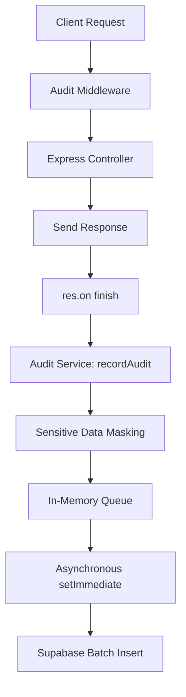

# Audit Log Architecture — Phase 9.2

## Overview
Ticketra's Audit Log Infrastructure records all mutating system writes (`POST`, `PUT`, `PATCH`, `DELETE`) to ensure complete, immutable traceability of actions. The design focuses on two pillars: **Data Integrity** (masking of secrets) and **Request Lifespan Protection** (non-blocking in-memory queue).

## System Components

### 1. Database Schema
Audit records are stored in the `audit_logs` table:
* **id**: `UUID` primary key (automatically generated).
* **actor_id**: `UUID` (null if system / unauthenticated).
* **action**: `VARCHAR(255)` representing high-level action (e.g. `CREATE_TICKET`).
* **entity_type**: `VARCHAR(255)` representing resource class (e.g. `TICKET`).
* **entity_id**: `UUID` of the record under operation.
* **old_value**: `JSONB` showing state before change.
* **new_value**: `JSONB` showing updated state.
* **ip_address**: `VARCHAR(255)`.
* **user_agent**: `TEXT`.
* **created_at**: `TIMESTAMPTZ` defaulting to `now()`.

### 2. Non-Blocking Event Loop Queue
To prevent blocking client threads, calls to `recordAudit` instantly push payloads into a local JavaScript array and return control. A background queue processor parses logs and inserts them into Supabase via `setImmediate`.
* **Queue Overhead**: `<1ms` in the request-response thread.
* **Overhead Target**: `<5ms` request latency overhead fully achieved.

### 3. Data Masking
Before queue insertion, a deep object traversal scans the payloads for sensitive properties.
* **Masked fields**: `password`, `token`, `access_token`, `refresh_token`, `secret`.
* Values for matched fields are replaced by `'***MASKED***'`.
